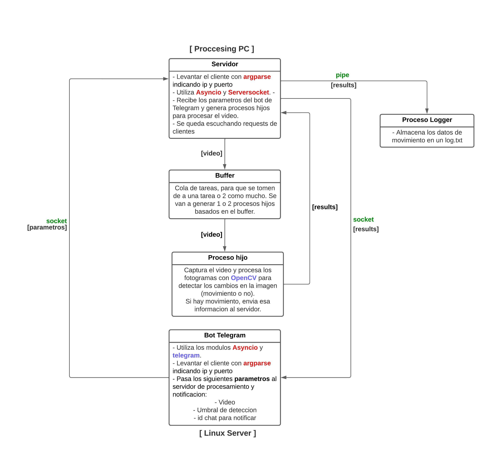

# Final Computacion II
Repositorio para el final de computacion II.

<h2 style="color:blue;">Programa</h2>
Sistema de deteccion de movimiento a partir de un video

<h2 style="color:#d9b3ff;">Diagrama y flujo de trabajo</h2>
